Notes for session 1
================
Ege Rubak (and Adrian Baddeley)
August 2022

## Introduction

In this workshop we will use the `spatstat` package in `R` (actually
`spatstat` is an umbrella for a collection of packages):

``` r
library(spatstat)
```

*Spatial data*= data attributed to spatial locations

Three main types of spatial data:

-   *spatial variable (“field”)*, eg temperature
-   *regional aggregate data*, eg accident counts in each state
-   *spatial point patterns*, eg locations of crimes/accidents

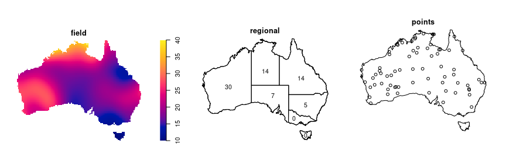

This workshop is about the analysis of *spatial point patterns*, and
this is also the main focus of the `spatstat` package.

## Spatial point pattern terminology

### Points

The “points” in a point pattern are the spatial locations where the
events or objects were observed. They are specified by spatial
coordinates. **NOTE:** In all that follows and for all functions in
`spatstat` the coordinates are assumed to be **projected coordinates in
Euclidean space**. Do not analyse geographic coordinates (latitude and
longitude) directly in `spatstat` – project them first! (Using e.g. the
`sf` package.)

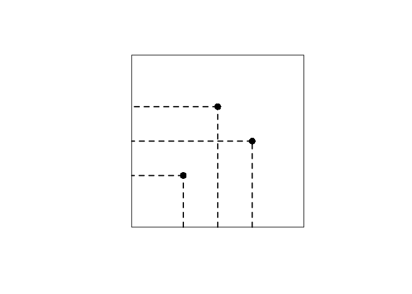<!-- -->

### Window

The window

is the spatial region where points were (or could have been) observed.

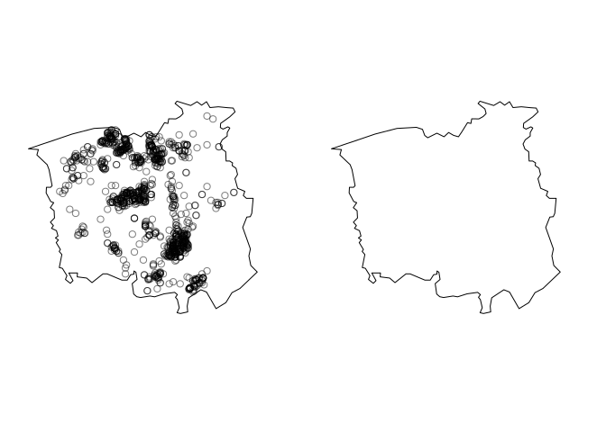<!-- -->

### Covariates

Covariates are explanatory variables (which might “explain” any spatial
variation in the abundance of points, for example).

Many covariates take the form of a function
, \quad u \in W")
defined at every spatial location
.

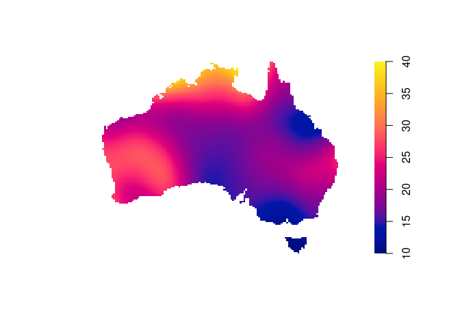<!-- -->

Alternatively, other kinds of spatial data can be treated as explanatory
data. Usually we need to translate them into spatial functions for use
in analysis.

### Marks

Marks are attributes of the individual events or things.

In a spatial point pattern of trees, the trees might be classified into
different species, and each tree carries a mark (“label”) indicating
which species it belongs to.

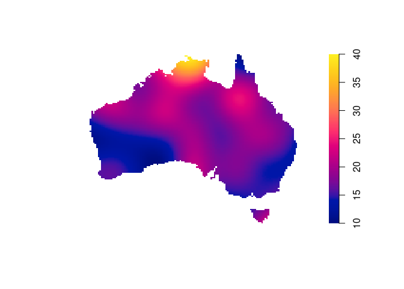<!-- -->

Marks are methodologically different from covariates: marks are part of
the “response”, not the ” explanatory variable”

## Software and data

### Spatstat

A point pattern dataset is represented an object belonging to the class
`"ppp"` (planar point pattern). Some datasets are included in the
package:

``` r
gordon
```

    ## Planar point pattern: 99 points
    ## window: polygonal boundary
    ## enclosing rectangle: [-26.408475, 26.408475] x [-36.32095, 36.32095] metres

``` r
class(gordon)
```

    ## [1] "ppp"

``` r
plot(gordon)
```

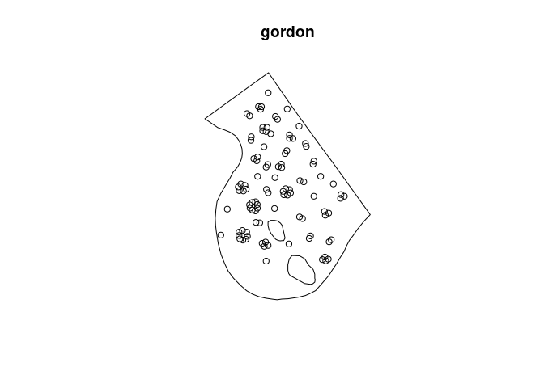<!-- -->

The spatial coordinates of the points can be extracted by
`as.data.frame`:

``` r
head(as.data.frame(gordon))
```

    ##              x        y
    ## 1  -6.19217799 29.89951
    ## 2 -12.95754899 23.24862
    ## 3 -11.57636899 15.81453
    ## 4  -0.09553099 24.72807
    ## 5   0.61446701 16.43510
    ## 6   0.61446701 15.30598

The window of observation for a point pattern can be extracted by
(notice the upper case W in `Window` – it is important):

``` r
W <- Window(gordon)
W
```

    ## window: polygonal boundary
    ## enclosing rectangle: [-26.408475, 26.408475] x [-36.32095, 36.32095] metres

``` r
class(W)
```

    ## [1] "owin"

This is an object of class `"owin"` (observation window) representing a
spatial region.

If the points also carry *marks*, the marks can be extracted by
`marks()` or `as.data.frame()`:

``` r
hyytiala
```

    ## Marked planar point pattern: 168 points
    ## Multitype, with levels = aspen, birch, pine, rowan 
    ## window: rectangle = [0, 20] x [0, 20] metres

``` r
marks(hyytiala)
```

    ##   [1] pine  pine  pine  pine  pine  pine  pine  pine  pine  pine  pine  pine  pine  pine  pine  pine  pine 
    ##  [18] pine  pine  pine  pine  pine  pine  pine  pine  pine  pine  pine  pine  pine  pine  pine  pine  pine 
    ##  [35] pine  pine  pine  pine  pine  pine  pine  pine  pine  pine  pine  pine  pine  pine  pine  pine  pine 
    ##  [52] pine  pine  pine  pine  pine  pine  pine  pine  pine  pine  pine  pine  pine  pine  pine  pine  pine 
    ##  [69] pine  pine  pine  pine  pine  pine  pine  pine  pine  pine  pine  pine  pine  pine  pine  pine  pine 
    ##  [86] pine  pine  pine  pine  pine  pine  pine  pine  pine  pine  pine  pine  pine  pine  pine  pine  pine 
    ## [103] pine  pine  pine  pine  pine  pine  pine  pine  pine  pine  pine  pine  pine  pine  pine  pine  pine 
    ## [120] pine  pine  pine  pine  pine  pine  pine  pine  pine  birch birch birch birch birch birch birch birch
    ## [137] birch birch birch birch birch birch birch birch birch rowan rowan rowan rowan rowan rowan rowan rowan
    ## [154] rowan rowan rowan rowan rowan rowan rowan rowan rowan rowan rowan rowan rowan rowan aspen
    ## Levels: aspen birch pine rowan

If the marks are a `factor` (categorical variable) then this specifies a
classification of the points into different groups.

The marks could also be numeric:

``` r
longleaf
```

    ## Marked planar point pattern: 584 points
    ## marks are numeric, of storage type  'double'
    ## window: rectangle = [0, 200] x [0, 200] metres

``` r
marks(longleaf)
```

    ##   [1] 32.9 53.5 68.0 17.7 36.9 51.6 66.4 17.7 21.9 25.7 25.5 28.3 11.2 33.8  2.5  4.2  2.5 31.2 16.4 53.2
    ##  [21] 67.3 37.8 49.9 46.3 40.5 57.7 58.0 54.9 25.3 18.4 72.0 31.4 55.1 36.0 28.4 24.8 44.1 50.9 47.5 58.0
    ##  [41] 36.9 65.6 52.9 39.5 42.7 44.4 40.3 53.5 44.2 53.8 38.0 48.3 42.9 40.6 34.5 45.7 51.8 52.0 44.5 35.6
    ##  [61] 19.2 43.5 33.7 43.3 36.6 46.3 48.3 20.4 40.5 44.0 40.9 51.0 36.5 42.1 15.6 18.5 43.0 28.9 21.3 30.9
    ##  [81] 42.7 37.6 47.1 44.6 44.3 26.1 25.9 41.4 59.5 26.1 11.4 33.4 35.8 54.4 33.6 35.5  7.4 36.6 19.1 34.9
    ## [101] 37.3 16.3 39.1 36.5 25.0 46.8 18.7 23.2 20.4 42.3 38.1 17.9 39.7 14.5 33.5 56.0 66.1 26.3 44.8 24.2
    ## [121] 39.0 15.1 35.6 21.6 17.2 22.3 18.2 55.6 23.3 27.0 50.1 45.5 47.2 37.8 31.9 38.5 23.8 46.3  2.8  3.2
    ## [141]  5.8  3.5  2.3  3.8  3.2  4.4  3.9  7.8  4.7  4.8 44.1 51.5 51.6 33.3 13.3  5.7  3.3 45.9 32.6 11.4
    ## [161]  9.1  5.2  4.9 42.0 32.0 32.8 22.0 20.8  7.3  3.0  2.2  2.2  2.2 59.4 48.1 51.5 50.3  2.9 19.1 15.1
    ## [181] 21.7 42.4 40.2 37.4 40.1 39.5 32.5 39.5 35.6 44.1 42.2 39.4 35.5 39.1  9.5 48.4 31.9 30.7 15.0 24.5
    ## [201] 15.0 22.2 27.5 10.8 26.2 10.2 18.9 44.2 13.8 16.7 35.7 12.1 35.4 32.7 30.1 28.4 16.5 12.7  5.5  2.5
    ## [221]  3.0  3.2  3.2  4.0  3.6  3.8  4.3  3.3  6.3 18.4  5.4  5.4 26.0 22.3 35.2 24.1  6.9 61.0 20.6  6.5
    ## [241]  2.8  4.8  5.4  4.3  4.0  3.2  2.8  4.9  3.5  2.9  2.4  3.3  2.1  2.0  3.9  5.0  2.3  2.2 67.7  2.9
    ## [261]  2.4 56.3 39.4 59.5 42.4 63.7 66.6 69.3 56.9 23.5  9.1 29.9 14.9 38.7 31.5 27.8 28.5 21.6  2.0  2.6
    ## [281]  2.3  3.5  3.6  2.6  2.0  2.0  2.7  2.6  2.2  2.7 30.1 16.6 10.4 11.8 32.3 33.5 30.5 10.5 13.8 22.8
    ## [301] 31.7 10.1 14.5 12.0  2.2  2.3  3.2  3.0 50.6  2.6 50.0 52.2  5.2  5.2  6.7 14.0 12.7 59.5 52.0 45.9
    ## [321] 18.0 43.5  3.3  4.3  7.4 10.1 23.1  8.1  5.7 13.3 12.8 11.6  6.3 20.0  8.9 27.6  4.5  9.2  2.3  5.0
    ## [341]  4.0 21.8 10.9 14.9 45.0 16.4 43.3 55.6 10.6 45.9 45.2 35.5 43.6 44.6 38.8 34.9 17.0 50.4  2.0 33.8
    ## [361] 51.1 21.8 46.5  5.6 19.6 32.3  3.7  2.7  2.5  2.5  2.4  7.2  7.0 11.8  8.5  9.5  7.0 10.5  6.6  6.6
    ## [381]  8.8 11.6 48.2 36.2 44.9 43.0 37.5 31.5 39.9 35.5 51.7 36.5 40.2  7.8 17.0 36.4 19.6 15.0 28.8 20.1
    ## [401] 39.3 37.9 40.6 33.0 35.7 20.6 22.0 16.3  5.6  7.4 42.3 43.8 53.0 48.1 41.9 48.0 75.9 40.4 40.9 39.4
    ## [421] 40.9 17.6 17.8  3.7 19.0 11.2 27.6 14.5 34.4 20.0  2.9  7.3 52.7  8.7  3.6  4.6 11.4 11.0 18.7  5.6
    ## [441]  2.1  3.3 11.5  2.6  4.4 18.3  7.5 17.2  4.6 32.0 56.7 46.0  7.8 54.9 45.5  9.2 13.2 15.3  8.5  2.2
    ## [461] 58.8 47.5 52.2 56.3 39.8 38.1 38.9  9.7  7.4 22.1 16.9  5.9 10.5  9.5 45.9 11.4  7.8 14.4  8.3 30.6
    ## [481] 44.4 38.7 41.5 34.5 31.8 39.7 23.3 37.7 43.0 39.2 40.4 36.7 48.4 27.9 46.4 38.5 39.4 50.0 51.6 38.7
    ## [501] 39.6 29.1 44.0 50.9 50.8 43.0 44.5 29.8 44.3 51.2 37.7 36.8 33.6 47.9 32.0 40.3 42.5 59.7 44.2 30.9
    ## [521] 39.5 48.7 32.8 47.2 42.1 43.8 30.5 28.3 10.4 15.0  7.4 15.3 17.5  5.0 12.2  9.0  2.4 13.7 13.1 12.8
    ## [541] 27.0  2.6  4.9 35.0 23.7 42.9 14.2  3.3 28.4 10.0  6.4 22.0  4.3 10.0  9.2  3.7 66.7 68.0 23.1  5.7
    ## [561] 11.7 40.4 43.3 60.2 55.5 54.1 22.3 21.4 55.7 51.4 23.9  5.2  7.6 27.8 49.6 51.0 50.7 43.4 55.6  4.3
    ## [581]  2.5 23.5  8.0 11.7

The marks could be multivariate:

``` r
finpines
```

    ## Marked planar point pattern: 126 points
    ## Mark variables: diameter, height 
    ## window: rectangle = [-5, 5] x [-8, 2] metres

``` r
head(marks(finpines))
```

    ##   diameter height
    ## 1        1    1.7
    ## 2        1    1.7
    ## 3        1    1.6
    ## 4        5    4.1
    ## 5        3    3.1
    ## 6        4    4.3

Other kinds of spatial objects in `spatstat` include:

-   pixel images: class `"im"`
-   spatial patterns of line segments: class `"psp"`
-   spatial tessellations: class `"tess"`

### Wrangling data

In this workshop, we will use datasets which are already installed in
*spatstat*, because time is short.

In practice, you would need to import your own data into `R`.

Data can be provided in many different file formats

-   text file, CSV file
-   shapefile
-   `netcdf` file

The `spatstat` package does not support reading and writing of files in
different formats. This would be poor software design.

Instead, if you need to read files in a particular format, we recommend
that you find an appropriate `R` package which is designed to read and
write that specific file format. Once the data have been read into `R`,
then you can use *another* `R` package to convert the data into objects
recognised by `spatstat`. (Package `sf` is recommended.)

It is often enough to use the functions `read.table` and `read.csv` in
the base `R` system which will read simple text files containing columns
of data and store them in `R` as a `data.frame`.

For full details please read the [free copy of Chapter 3 the spatstat
book](http://book.spatstat.org/sample-chapters/chapter03.pdf)

# Intensity

Often the main objective is to study the “density” of points in the
point pattern and to investigate any spatial variation in this density.

## Point processes

In a statistical approach to data analysis, we think of the observed
data as the outcome of a random process.

To analyse spatial point pattern data, we will regard the observed
*point pattern*

as a realisation of a random *point process*
.

It is helpful to visualise a point process as a collection (“ensemble”)
of many different possible outcomes. Here is one example:

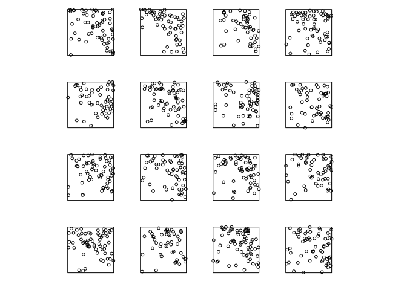

# Intensity

The *intensity* of a point process is the expected number of points per
unit area. It may be a constant
,
or it may be spatially varying.

Intensity is an average, over all possible outcomes of the point
process. We can visualise it by superimposing the ensemble of outcomes:

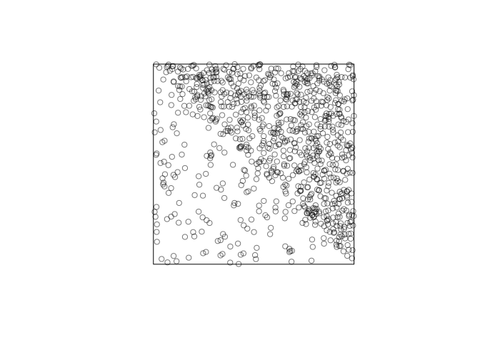<!-- -->

We will usually assume that the point process has an *intensity
function*
")
defined at every spatial location
.
Then
")
is the spatially-varying expected number of points per unit area. It is
formally defined to satisfy

![E\[ n(B \cap X) \] = \int_B \lambda(u) \\, {\rm d}u](https://latex.codecogs.com/png.image?%5Cdpi%7B110%7D&space;%5Cbg_white&space;E%5B%20n%28B%20%5Ccap%20X%29%20%5D%20%3D%20%5Cint_B%20%5Clambda%28u%29%20%5C%2C%20%7B%5Crm%20d%7Du "E[ n(B \cap X) ] = \int_B \lambda(u) \, {\rm d}u")

for any region
,
where
")
denotes the number of points falling in
.

Intensity is closely related to probability density. If

is a point process with intensity function
"),
then each individual point inside

has probability density
 = \lambda(u)/\Lambda_W"),
where
 \, {\rm d}u").

## Nonparametric estimation

Because of the close relationship between intensity and probability
density, methods for nonparametric estimation of the intensity function
are very similar to methods for density estimation.

### Nonparametric estimation of spatially-varying intensity

Given a point pattern

in a window

the kernel estimate of intensity is

 = \sum_{i=1}^n k(u - x_i) e(u, x_i)")

where
")
is the smoothing kernel and
")
is a correction for edge effects.

``` r
library(spatstat)
plot(japanesepines)
```

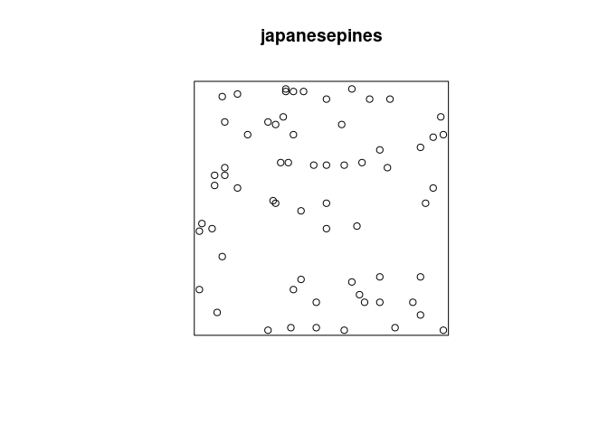<!-- -->

``` r
Z <- density(japanesepines, sigma=0.1)
plot(Z)
```

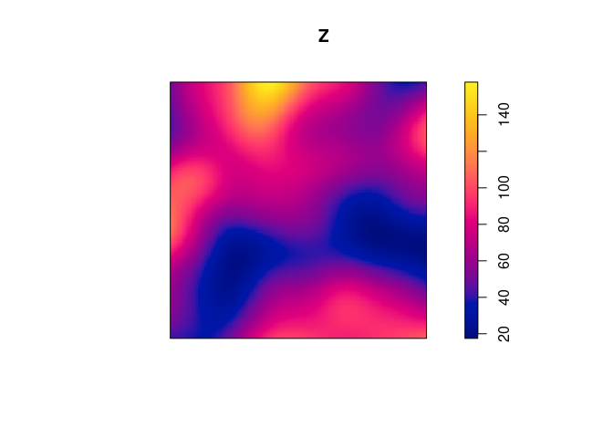<!-- -->

The command in `spatstat` to compute the kernel estimate of intensity is
`density.ppp`, a method for the generic function `density`.

The argument `sigma` is the bandwidth of the smoothing kernel.

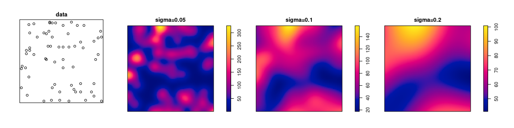

Bandwidth can be selected automatically:

``` r
bw.ppl(japanesepines)
```

    ## Warning: Likelihood Cross-Validation criterion was minimised at right-hand end of interval [0.01, 0.707];
    ## use argument 'srange' to specify a wider interval for bandwidth 'sigma'

    ##     sigma 
    ## 0.7071068

``` r
bw.CvL(japanesepines)
```

    ##      sigma 
    ## 0.09691522

``` r
bw.diggle(japanesepines)
```

    ##      sigma 
    ## 0.05870841

``` r
bw.scott(japanesepines)
```

    ##   sigma.x   sigma.y 
    ## 0.1415691 0.1567939

### Nonparametric estimation of spatially-varying, mark-dependent intensity

A marked point pattern, with marks which are categorical values,
effectively classifies the points into different types.

``` r
mucosa
```

    ## Marked planar point pattern: 965 points
    ## Multitype, with levels = ECL, other 
    ## window: rectangle = [0, 1] x [0, 0.81] units

``` r
plot(mucosa, cols=c(2,3))
```

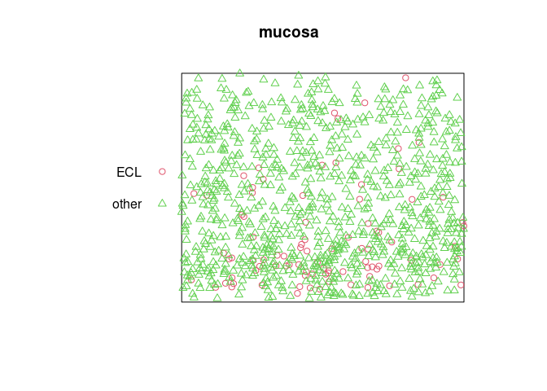<!-- -->

Extract the sub-patterns of points of each type:

``` r
M <- split(mucosa)
M
```

    ## Point pattern split by factor 
    ## 
    ## ECL:
    ## Planar point pattern: 89 points
    ## window: rectangle = [0, 1] x [0, 0.81] units
    ## 
    ## other:
    ## Planar point pattern: 876 points
    ## window: rectangle = [0, 1] x [0, 0.81] units

``` r
class(M)
```

    ## [1] "splitppp" "ppplist"  "solist"   "list"

``` r
plot(M)
```

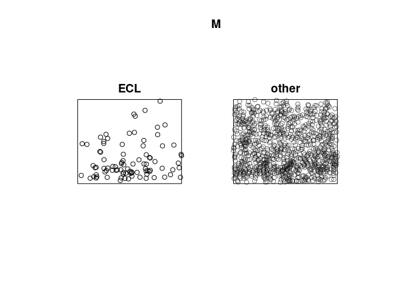<!-- -->

Apply kernel smoothing to each sub-pattern using `density.splitppp`:

``` r
B <- density(M, sigma=bw.ppl)
B
```

    ## List of pixel images
    ## 
    ## ECL:
    ## real-valued pixel image
    ## 128 x 128 pixel array (ny, nx)
    ## enclosing rectangle: [0, 1] x [0, 0.81] units
    ## 
    ## other:
    ## real-valued pixel image
    ## 128 x 128 pixel array (ny, nx)
    ## enclosing rectangle: [0, 1] x [0, 0.81] units

``` r
plot(B)
```

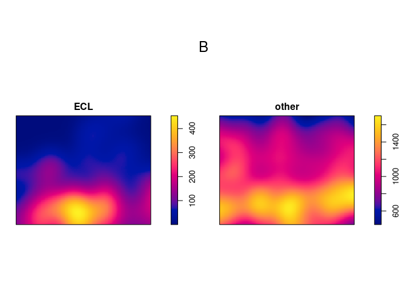<!-- -->

Suppose
")
is the intensity function of the points of type
,
for
.
The intensity function of all points regardless of type is

 = \sum_{i=1}^m \lambda_i(u).")

Under reasonable assumptions, the probability that a random point at
location

belongs to type

is

 = \frac{\lambda_i(u)}{\lambda_{\bullet}(u)}.")

We could calculate this by hand in `spatstat`:

``` r
lambdaECL <- B[["ECL"]]
lambdaOther <- B[["other"]]
lambdaDot <- lambdaECL + lambdaOther
pECL <- lambdaECL/lambdaDot
pOther <- lambdaOther/lambdaDot
plot(pECL)
```

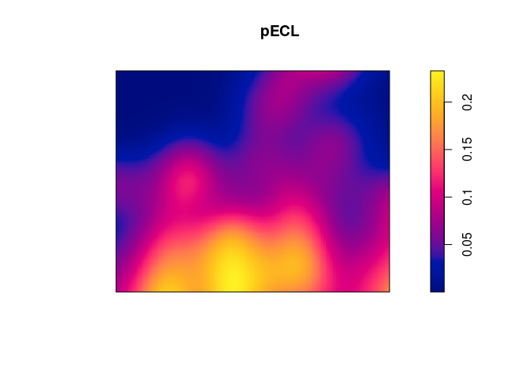<!-- -->

These calculations are automated in the function `relrisk` (relative
risk):

``` r
V <- relrisk(mucosa, bw.ppl, casecontrol=FALSE)
plot(V, main="")
```

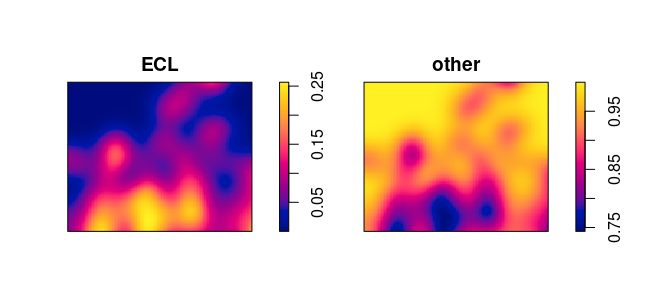<!-- -->

Bandwidth selection for the ratio is different from bandwidth selection
for the intensity. We recommend using the special algorithm
`bw.relrisk`:

``` r
bw.relrisk(mucosa)
```

    ##     sigma 
    ## 0.1282096

``` r
Vr <- relrisk(mucosa, bw.relrisk, casecontrol=FALSE)
plot(Vr, main="")
```

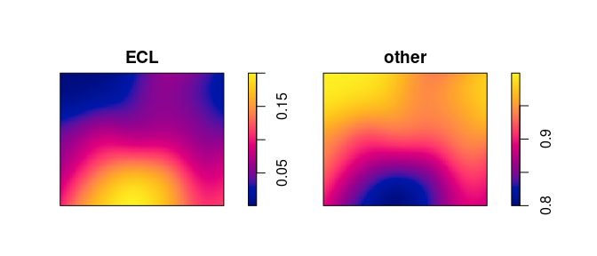<!-- -->

### Segregation of types

“Segregation” occurs if the probability distribution of types of points
is spatially varying.

A Monte Carlo test of segregation can be performed using the
nonparametric estimators described above. The function
`segregation.test` performs it.

``` r
segregation.test(mucosa, sigma=0.15, verbose=FALSE)
```

    ## 
    ##  Monte Carlo test of spatial segregation of types
    ## 
    ## data:  mucosa
    ## T = 4.2041, p-value = 0.05

The principle of a Monte Carlo test is:

1.  Generate
    
    simulations under the null hypothesis
2.  Calculate the same statistic
    
    for the data and the simulations
3.  Conclude based on the rank (extremeness) of the observed statistic
    for data

Under the null hypothesis the distribution of

is exchangeable and the probability that the data statistic

is most extreme under a one-sided alternative is 1/(m+1). So a one-sided
test with

corresponds to significance level
.

More generally the p-values for larger, smaller or two-sided
alternatives is:


From the help file of `segregation.test()`:

> The Monte Carlo test of spatial segregation of types, proposed by
> Kelsall and Diggle (1995) and Diggle et al (2005), is applied to the
> point pattern . The test statistic is
>
>  - \overline p_m
>   \right)^2")
>
> where
> ")
> is the leave-one-out kernel smoothing estimate of the probability that
> the
> -th
> data point has type
> ,
> and
> 
> is the average fraction of data points which are of type
> .
> The statistic
> 
> is evaluated for the data and for `nsim` randomised versions of `X`,
> generated by randomly permuting or resampling the marks.
>
> Note that, by default, automatic bandwidth selection will be performed
> separately for each randomised pattern. This computation can be very
> time-consuming but is necessary for the test to be valid in most
> conditions. A short-cut is to specify the value of the smoothing
> bandwidth as shown in the examples.

### Nonparametric estimation of intensity depending on a covariate

In some applications we believe that the intensity depends on a spatial
covariate
,
in the form

 = \rho(Z(u))")

where
")
is an unknown function which we want to estimate. A nonparametric
estimator of

is

 = \frac{\sum_{i=1}^n k(Z(x_i) - z)}{\int_W k(Z(u) - z) \, {\rm d} u}")

where
")
is a one-dimensional smoothing kernel. This is computed by `rhohat`.

*Example*: mucosa data, enterochromaffin-like cells (ECL)

``` r
E <- split(mucosa)$ECL
plot(E)
```

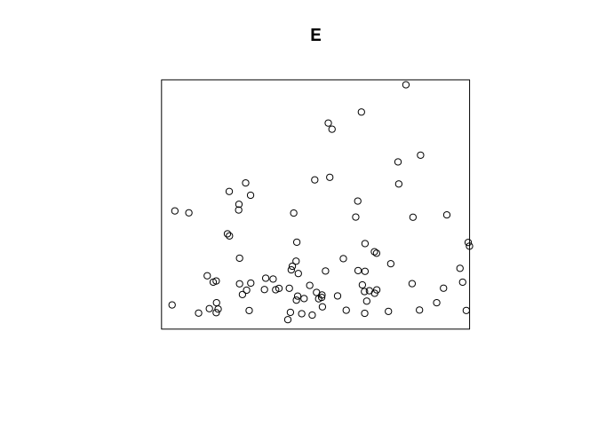<!-- -->

The wall of the gut is at the bottom of the picture. Cell density
appears to decline as we go further away from the wall. Use the string
`"y"` to refer to the

coordinate:

``` r
g <- rhohat(E, "y")
plot(g)
```

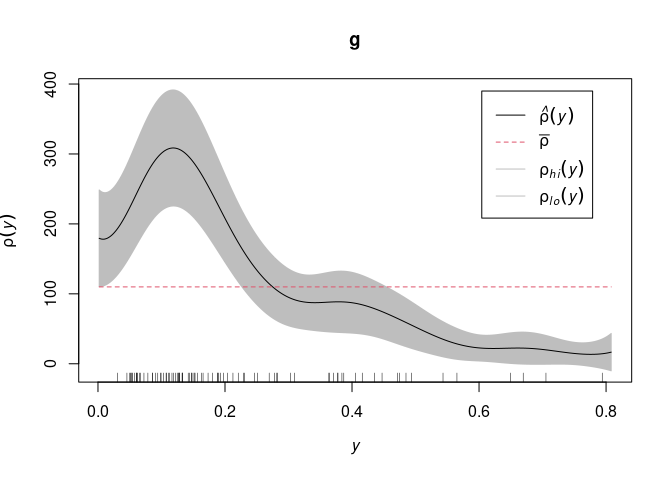<!-- -->

*Example*: Murchison gold survey.

``` r
X <- murchison$gold
L <- murchison$faults
X <- rescale(X, 1000, "km")
L <- rescale(L, 1000, "km")
D <- distfun(L)
plot(solist(gold=X, faults=L, distance=D), main="", equal.scales=TRUE)
```

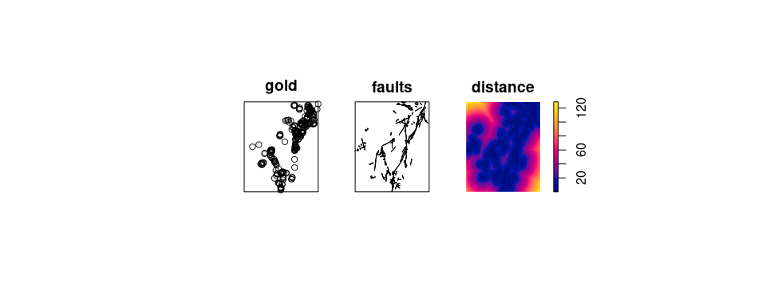<!-- -->

Gold deposits are frequently found near a geological fault line. Here we
converted the fault line pattern into a spatial covariate

 = \mbox{ distance from } u \mbox{ to nearest fault }")

``` r
h <- rhohat(X, D)
plot(h, xlim = c(0, 20))
```

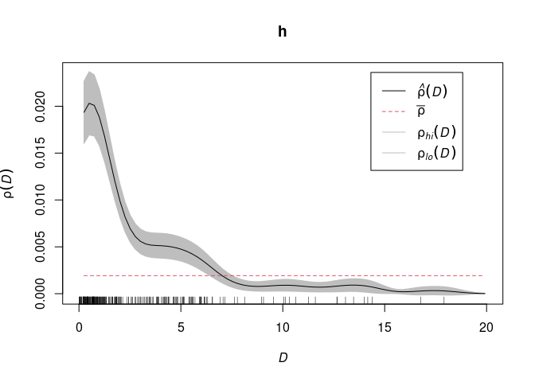<!-- -->
