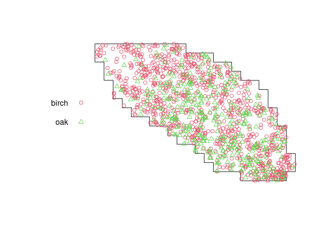
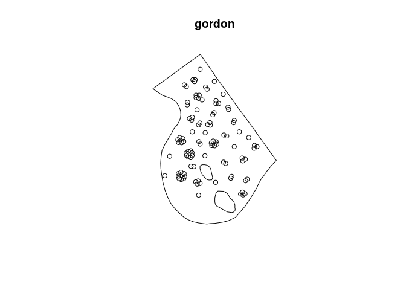

Notes for session 1
================
Ege Rubak
August 2022

## Introduction

*Spatial data*= data attributed to spatial locations

Three main types of spatial data:

-   *spatial variable (“field”)*, eg temperature
-   *regional aggregate data*, eg accident counts in each state
-   *spatial point patterns*, eg locations of crimes/accidents


This workshop is about the analysis of *spatial point patterns*

We will use the `spatstat` package in `R`

``` r
library(spatstat)
```

## Spatial point pattern terminology

### Points

The “points” in a point pattern are the spatial locations where the
events or objects were observed. They are specified by spatial
coordinates. **NOTE:** In all that follows and for all functions in
`spatstat` the coordinates are assumed to be **projected coordinates in
Euclidean space**. Do not analyse geographic coordinates (latitude and
longitude) directly in `spatstat` – project them first!

<!-- -->

### Window

The window

is the spatial region where points were (or could have been) observed.

<!-- -->

### Covariates

Covariates are explanatory variables (which might “explain” any spatial
variation in the abundance of points, for example).

Many covariates take the form of a function
, \quad u \in W")
defined at every spatial location
.

<!-- -->

Alternatively, other kinds of spatial data can be treated as explanatory
data. Usually we need to translate them into spatial functions for use
in analysis.

### Marks

Marks are attributes of the individual events or things.

In a spatial point pattern of trees, the trees might be classified into
different species, and each tree carries a mark (“label”) indicating
which species it belongs to.

<!-- -->

Marks are methodologically different from covariates: marks are part of
the “response”, not the ” explanatory variable”

## Software and data

### Spatstat

``` r
library(spatstat)
```

A point pattern dataset is represented an object belonging to the class
`"ppp"` (planar point pattern). Some datasets are included in the
package:

``` r
gordon
```

    ## Planar point pattern: 99 points
    ## window: polygonal boundary
    ## enclosing rectangle: [-26.408475, 26.408475] x [-36.32095, 36.32095] metres

``` r
class(gordon)
```

    ## [1] "ppp"

``` r
plot(gordon)
```

<!-- -->

The spatial coordinates of the points can be extracted by
`as.data.frame`:

``` r
head(as.data.frame(gordon))
```

    ##              x        y
    ## 1  -6.19217799 29.89951
    ## 2 -12.95754899 23.24862
    ## 3 -11.57636899 15.81453
    ## 4  -0.09553099 24.72807
    ## 5   0.61446701 16.43510
    ## 6   0.61446701 15.30598

The window of observation for a point pattern can be extracted by:

``` r
W <- Window(gordon)
W
```

    ## window: polygonal boundary
    ## enclosing rectangle: [-26.408475, 26.408475] x [-36.32095, 36.32095] metres

``` r
class(W)
```

    ## [1] "owin"

This is an object of class `"owin"` (observation window) representing a
spatial region.

If the points also carry *marks*, the marks can be extracted by
`marks()` or `as.data.frame()`:

``` r
hyytiala
```

    ## Marked planar point pattern: 168 points
    ## Multitype, with levels = aspen, birch, pine, rowan 
    ## window: rectangle = [0, 20] x [0, 20] metres

``` r
marks(hyytiala)
```

    ##   [1] pine  pine  pine  pine  pine  pine  pine  pine  pine  pine  pine  pine 
    ##  [13] pine  pine  pine  pine  pine  pine  pine  pine  pine  pine  pine  pine 
    ##  [25] pine  pine  pine  pine  pine  pine  pine  pine  pine  pine  pine  pine 
    ##  [37] pine  pine  pine  pine  pine  pine  pine  pine  pine  pine  pine  pine 
    ##  [49] pine  pine  pine  pine  pine  pine  pine  pine  pine  pine  pine  pine 
    ##  [61] pine  pine  pine  pine  pine  pine  pine  pine  pine  pine  pine  pine 
    ##  [73] pine  pine  pine  pine  pine  pine  pine  pine  pine  pine  pine  pine 
    ##  [85] pine  pine  pine  pine  pine  pine  pine  pine  pine  pine  pine  pine 
    ##  [97] pine  pine  pine  pine  pine  pine  pine  pine  pine  pine  pine  pine 
    ## [109] pine  pine  pine  pine  pine  pine  pine  pine  pine  pine  pine  pine 
    ## [121] pine  pine  pine  pine  pine  pine  pine  pine  birch birch birch birch
    ## [133] birch birch birch birch birch birch birch birch birch birch birch birch
    ## [145] birch rowan rowan rowan rowan rowan rowan rowan rowan rowan rowan rowan
    ## [157] rowan rowan rowan rowan rowan rowan rowan rowan rowan rowan rowan aspen
    ## Levels: aspen birch pine rowan

If the marks are a `factor` (categorical variable) then this specifies a
classification of the points into different groups.

The marks could also be numeric:

``` r
longleaf
```

    ## Marked planar point pattern: 584 points
    ## marks are numeric, of storage type  'double'
    ## window: rectangle = [0, 200] x [0, 200] metres

``` r
marks(longleaf)
```

    ##   [1] 32.9 53.5 68.0 17.7 36.9 51.6 66.4 17.7 21.9 25.7 25.5 28.3 11.2 33.8  2.5
    ##  [16]  4.2  2.5 31.2 16.4 53.2 67.3 37.8 49.9 46.3 40.5 57.7 58.0 54.9 25.3 18.4
    ##  [31] 72.0 31.4 55.1 36.0 28.4 24.8 44.1 50.9 47.5 58.0 36.9 65.6 52.9 39.5 42.7
    ##  [46] 44.4 40.3 53.5 44.2 53.8 38.0 48.3 42.9 40.6 34.5 45.7 51.8 52.0 44.5 35.6
    ##  [61] 19.2 43.5 33.7 43.3 36.6 46.3 48.3 20.4 40.5 44.0 40.9 51.0 36.5 42.1 15.6
    ##  [76] 18.5 43.0 28.9 21.3 30.9 42.7 37.6 47.1 44.6 44.3 26.1 25.9 41.4 59.5 26.1
    ##  [91] 11.4 33.4 35.8 54.4 33.6 35.5  7.4 36.6 19.1 34.9 37.3 16.3 39.1 36.5 25.0
    ## [106] 46.8 18.7 23.2 20.4 42.3 38.1 17.9 39.7 14.5 33.5 56.0 66.1 26.3 44.8 24.2
    ## [121] 39.0 15.1 35.6 21.6 17.2 22.3 18.2 55.6 23.3 27.0 50.1 45.5 47.2 37.8 31.9
    ## [136] 38.5 23.8 46.3  2.8  3.2  5.8  3.5  2.3  3.8  3.2  4.4  3.9  7.8  4.7  4.8
    ## [151] 44.1 51.5 51.6 33.3 13.3  5.7  3.3 45.9 32.6 11.4  9.1  5.2  4.9 42.0 32.0
    ## [166] 32.8 22.0 20.8  7.3  3.0  2.2  2.2  2.2 59.4 48.1 51.5 50.3  2.9 19.1 15.1
    ## [181] 21.7 42.4 40.2 37.4 40.1 39.5 32.5 39.5 35.6 44.1 42.2 39.4 35.5 39.1  9.5
    ## [196] 48.4 31.9 30.7 15.0 24.5 15.0 22.2 27.5 10.8 26.2 10.2 18.9 44.2 13.8 16.7
    ## [211] 35.7 12.1 35.4 32.7 30.1 28.4 16.5 12.7  5.5  2.5  3.0  3.2  3.2  4.0  3.6
    ## [226]  3.8  4.3  3.3  6.3 18.4  5.4  5.4 26.0 22.3 35.2 24.1  6.9 61.0 20.6  6.5
    ## [241]  2.8  4.8  5.4  4.3  4.0  3.2  2.8  4.9  3.5  2.9  2.4  3.3  2.1  2.0  3.9
    ## [256]  5.0  2.3  2.2 67.7  2.9  2.4 56.3 39.4 59.5 42.4 63.7 66.6 69.3 56.9 23.5
    ## [271]  9.1 29.9 14.9 38.7 31.5 27.8 28.5 21.6  2.0  2.6  2.3  3.5  3.6  2.6  2.0
    ## [286]  2.0  2.7  2.6  2.2  2.7 30.1 16.6 10.4 11.8 32.3 33.5 30.5 10.5 13.8 22.8
    ## [301] 31.7 10.1 14.5 12.0  2.2  2.3  3.2  3.0 50.6  2.6 50.0 52.2  5.2  5.2  6.7
    ## [316] 14.0 12.7 59.5 52.0 45.9 18.0 43.5  3.3  4.3  7.4 10.1 23.1  8.1  5.7 13.3
    ## [331] 12.8 11.6  6.3 20.0  8.9 27.6  4.5  9.2  2.3  5.0  4.0 21.8 10.9 14.9 45.0
    ## [346] 16.4 43.3 55.6 10.6 45.9 45.2 35.5 43.6 44.6 38.8 34.9 17.0 50.4  2.0 33.8
    ## [361] 51.1 21.8 46.5  5.6 19.6 32.3  3.7  2.7  2.5  2.5  2.4  7.2  7.0 11.8  8.5
    ## [376]  9.5  7.0 10.5  6.6  6.6  8.8 11.6 48.2 36.2 44.9 43.0 37.5 31.5 39.9 35.5
    ## [391] 51.7 36.5 40.2  7.8 17.0 36.4 19.6 15.0 28.8 20.1 39.3 37.9 40.6 33.0 35.7
    ## [406] 20.6 22.0 16.3  5.6  7.4 42.3 43.8 53.0 48.1 41.9 48.0 75.9 40.4 40.9 39.4
    ## [421] 40.9 17.6 17.8  3.7 19.0 11.2 27.6 14.5 34.4 20.0  2.9  7.3 52.7  8.7  3.6
    ## [436]  4.6 11.4 11.0 18.7  5.6  2.1  3.3 11.5  2.6  4.4 18.3  7.5 17.2  4.6 32.0
    ## [451] 56.7 46.0  7.8 54.9 45.5  9.2 13.2 15.3  8.5  2.2 58.8 47.5 52.2 56.3 39.8
    ## [466] 38.1 38.9  9.7  7.4 22.1 16.9  5.9 10.5  9.5 45.9 11.4  7.8 14.4  8.3 30.6
    ## [481] 44.4 38.7 41.5 34.5 31.8 39.7 23.3 37.7 43.0 39.2 40.4 36.7 48.4 27.9 46.4
    ## [496] 38.5 39.4 50.0 51.6 38.7 39.6 29.1 44.0 50.9 50.8 43.0 44.5 29.8 44.3 51.2
    ## [511] 37.7 36.8 33.6 47.9 32.0 40.3 42.5 59.7 44.2 30.9 39.5 48.7 32.8 47.2 42.1
    ## [526] 43.8 30.5 28.3 10.4 15.0  7.4 15.3 17.5  5.0 12.2  9.0  2.4 13.7 13.1 12.8
    ## [541] 27.0  2.6  4.9 35.0 23.7 42.9 14.2  3.3 28.4 10.0  6.4 22.0  4.3 10.0  9.2
    ## [556]  3.7 66.7 68.0 23.1  5.7 11.7 40.4 43.3 60.2 55.5 54.1 22.3 21.4 55.7 51.4
    ## [571] 23.9  5.2  7.6 27.8 49.6 51.0 50.7 43.4 55.6  4.3  2.5 23.5  8.0 11.7

The marks could be multivariate:

``` r
finpines
```

    ## Marked planar point pattern: 126 points
    ## Mark variables: diameter, height 
    ## window: rectangle = [-5, 5] x [-8, 2] metres

``` r
head(marks(finpines))
```

    ##   diameter height
    ## 1        1    1.7
    ## 2        1    1.7
    ## 3        1    1.6
    ## 4        5    4.1
    ## 5        3    3.1
    ## 6        4    4.3

Other kinds of spatial objects in `spatstat` include:

-   pixel images: class `"im"`
-   spatial patterns of line segments: class `"psp"`
-   spatial tessellations: class `"tess"`

### Wrangling data

In this workshop, we will use datasets which are already installed in
*spatstat*, because time is short.

In practice, you would need to import your own data into `R`.

Data can be provided in many different file formats

-   text file, CSV file
-   shapefile
-   `netcdf` file

The `spatstat` package does not support reading and writing of files in
different formats. This would be poor software design.

Instead, if you need to read files in a particular format, we recommend
that you find an appropriate `R` package which is designed to read and
write that specific file format. Once the data have been read into `R`,
then you can use *another* `R` package to convert the data into objects
recognised by `spatstat`.

It is often enough to use the functions `read.table` and `read.csv` in
the base `R` system which will read simple text files containing columns
of data and store them in `R` as a `data.frame`.

For full details please read the [free copy of Chapter 3 the spatstat
book](http://book.spatstat.org/sample-chapters/chapter03.pdf)
